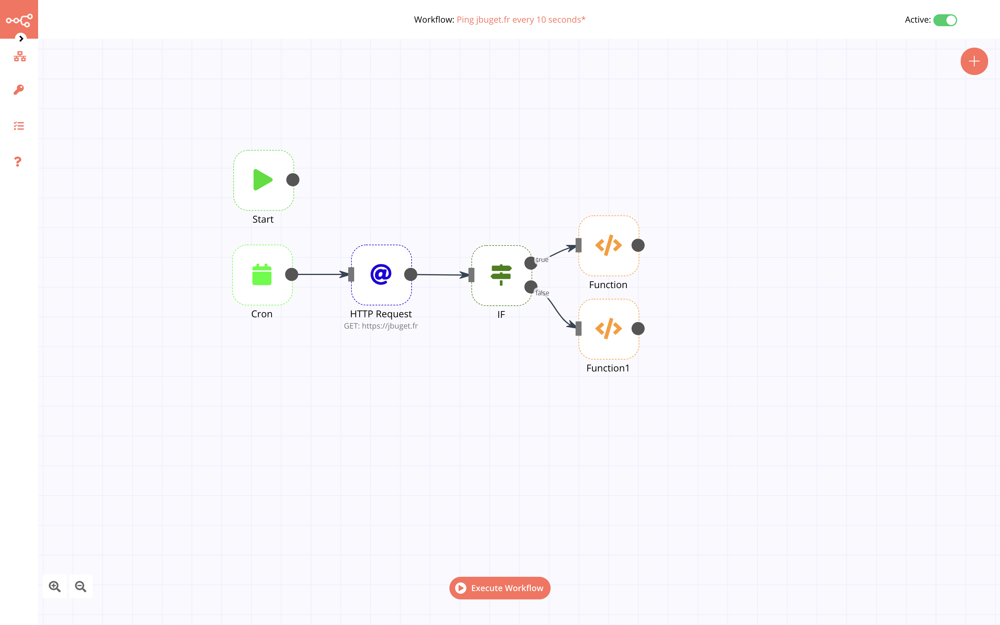

# n8n-scalingo

[](https://opensource.org/licenses/MIT)



## Installation

### 1. Declare a new application in Scalingo

1. Create a new Scalingo application
2. Add PostgreSQL (officially recommended by n8n) addon
3. Define and configure required environment variables (cf. below)
4. (bonus) Activate "Force HTTPS" in Scalingo app settings
5. (bonus) Link your domain name to the app (in "Domain/DSL" section into the Scalingo app dashboard) 

### 2. Deploy n8n application into your app

It is recommended to use [Scalingo archive deployment](https://doc.scalingo.com/platform/deployment/deploy-from-archive) instead of code source deployment because we want to install a *finished product* (but if you want, you can).

> **Good to know!** GitHub allows downloading ZIP files and tarballs for each release of each repository that allows it. Ex: https://github.com/jbuget/n8n-scalingo/archive/v0.101.0.zip

Use the Scalingo CLI `deploy` command with GitHub project tar.gz URL as following:

```bash
scalingo --app my-n8n-app deploy https://github.com/jbuget/n8n-scalingo/archive/v0.101.0.tar.gz
```

## Configuration

### 1. Required configuration

Running n8n on Scalingo requires at least to **link Scalingo app port (randomly attributed) to n8n internal server**. Long words, short step. 

Just add the following environment variable: `N8N_PORT=$PORT`.

### 2. Database configuration

If you don't want to lose your settings, workflows and execution data each time your Scalingo app crashes or restarts, you MUST configure a database.

> **Good to know!** [n8n recommends to use PostgreSQL](https://docs.n8n.io/reference/data/database.html#mongodb).

According to the n8n documentation, and thanks to the `SCALINGO_POSTGRESQL_URL` automatically generated variable define the following environment variables:

```bash
DB_POSTGRESDB_DATABASE=xxx
DB_POSTGRESDB_HOST=xxx.postgresql.dbs.scalingo.com
DB_POSTGRESDB_PASSWORD=xxx
DB_POSTGRESDB_PORT=xxx
DB_POSTGRESDB_USER=xxx
DB_TYPE=postgresdb
```

### 3. DNS and webhook configuration

In order to enable n8n webhooks and other future or advanced features, set up the n8n publication variables:

```bash
N8N_HOST=my.n8n.app.dns
N8N_PROTOCOL=https
```

### 4. Other stuff

Configuring n8n through Scalingo is as easy as:
1. read [the official documentation](https://docs.n8n.io/reference/configuration.html) and
2. define the environment variables you need [into your Scalingo application](https://doc.scalingo.com/platform/app/environment).

## Upgrade

Thanks to the excellent work of the n8n team, you have only a very few to do to upgrade from v(X) to v(X+1).

Just deploy a new release archive as described above with Scalingo deploy service.

In this repository, we will [release a new version](https://github.com/jbuget/n8n-scalingo/tags) each time the offical n8n team will.

> **Good to know!** The only thing we have to do, is to bump the fixed version of n8n dependency in the package.json (with its lock file). You can even provide a Pull Request to help us!  

Even the database migration scripts are run automatically if necessary at the app startup. 😎

## License

This project and its code source are under [MIT license](https://opensource.org/licenses/MIT).
